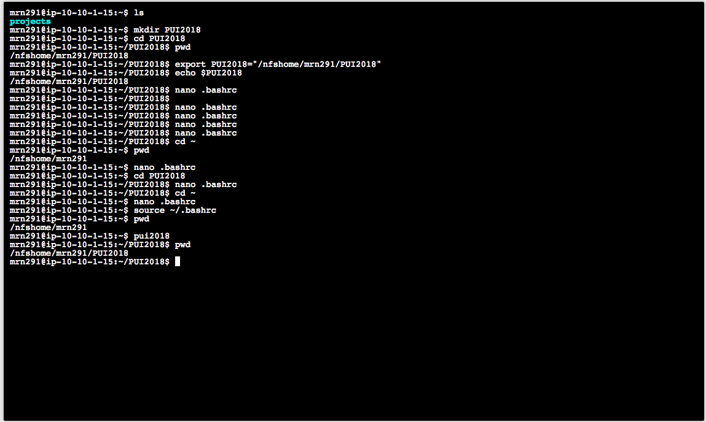
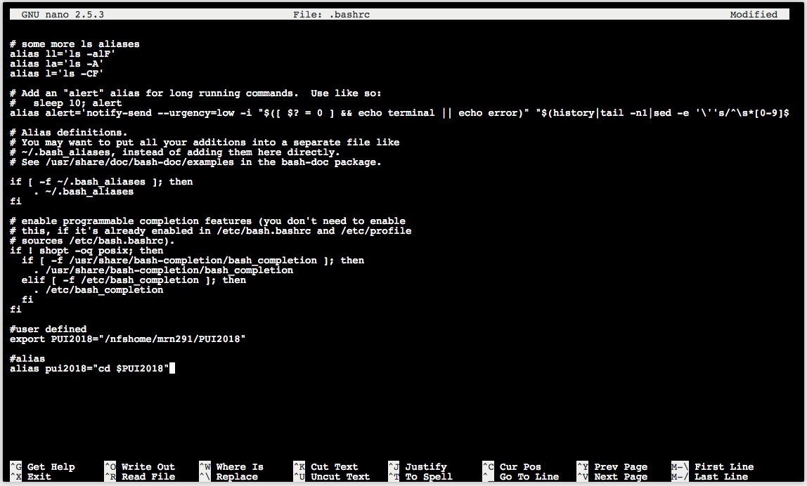

# HW1_mrn291

I completed this homework independently, consulting my course notes and the course materials from the github repository.

I did initially make a mistake and try and edit the .bashrc file in a different directory than home!  That did not work.  Learn from my mistake.

I also attempted the extra credit which can be found in this repository as well.

