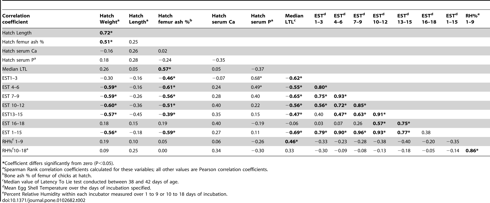
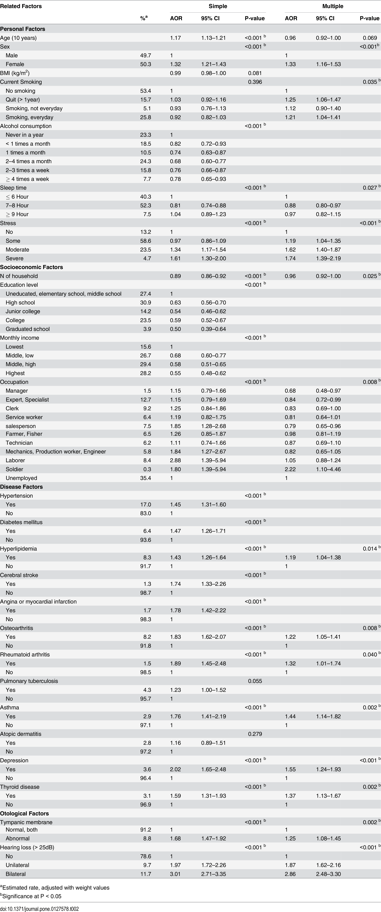

# Homework Assignment 5 for PUI2018 Morning Session

## Please note that I switched sessions with TA permission this week and so am completing the morning session homework assigned for the week of 10/3-10/4 and the evening session homework assigned for 10/11.

#### Part One

I submitted a pull request from my forked copy to my assigned partner, Pranay Achan, pya209, and it was accepted.  The text is also in my own repository but found [here on the fork](https://github.com/pranay-anchan/PUI2018_pya209/blob/master/HW4_pya209/CitibikeReview_mrn291.md).

#### Part Two

| Statistical Analysis | Independent Variable(s)                     | Independent Variable Types | Dependent Variables | Dependent Variable Types | Control Variables | Control Variable Types | Question to be Answered                                                                                                                | Null Hypothesis                                                                                             | alpha    | Title                                                                                                                                                                   |
|----------------------|---------------------------------------------|----------------------------|---------------------|--------------------------|-------------------|------------------------|----------------------------------------------------------------------------------------------------------------------------------------|-------------------------------------------------------------------------------------------------------------|----------|-------------------------------------------------------------------------------------------------------------------------------------------------------------------------|
| ANOVA                | Isotope and fatty acid signatures of faeces | Numerical, Continuous      | Feeding preferences | Categorical              |                   |                        | Can you tell the difference between three different species of bats based on the ratios of the isotope and fatty acids in their feces? | There is no difference between the ratios of isotopes and fatty acids in the three different kinds of bats. | p < 0.05 | [Tracking Diet Preferences of Bats Using Stable Isotope and Fatty Acid Signatures of Faeces](https://journals.plos.org/plosone/article?id=10.1371/journal.pone.0083452) |

| Statistical Analysis | Independent Variable(s)   | Independent Variable Types | Dependent Variables                | Dependent Variable Types          | Control Variables | Control Variable Types | Question to be Answered                                                                              | Null Hypothesis                                                                                                 | alpha    | Title                                                                                                                                                                   |
|----------------------|---------------------------|----------------------------|------------------------------------|-----------------------------------|-------------------|------------------------|------------------------------------------------------------------------------------------------------|-----------------------------------------------------------------------------------------------------------------|----------|-------------------------------------------------------------------------------------------------------------------------------------------------------------------------|
| Multiple Regression  | Tempurature at Incubation | Numerical, Continuous      | Femoral Bone Ash %, Latency to Lie | Numerical/Continuous, Categorical |                   |                        | Can you predict a chick's femoral bone ash % and latency to lie using the temperature at incubation? | There is no relationship between femoral bone ash percentage, latentency to lie, and temperature at incubation. | p < 0.05 | [Tracking Diet Preferences of Bats Using Stable Isotope and Fatty Acid Signatures of Faeces](https://journals.plos.org/plosone/article?id=10.1371/journal.pone.0102682) |

| Statistical Analysis | Independent Variable(s) | Independent Variable Types | Dependent Variables                                                                         | Dependent Variable Types | Control Variables | Control Variable Types | Question to be Answered                                                     | Null Hypothesis                                               | alpha    | Title                                                                                                                                                                   |
|----------------------|-------------------------|----------------------------|---------------------------------------------------------------------------------------------|--------------------------|-------------------|------------------------|-----------------------------------------------------------------------------|---------------------------------------------------------------|----------|-------------------------------------------------------------------------------------------------------------------------------------------------------------------------|
| Logistic Regression  | Tinnitus                | Categorical                | Many, including age, gender, smoking history, household size, stress, thyroid disease, etc. | Mostly categorical       |                   |                        | Which features are most correlated with a self-reported tinnitus diagnosis? | Tinnitus is random with respect to age, gender, smoking, etc. | p < 0.05 | [Tracking Diet Preferences of Bats Using Stable Isotope and Fatty Acid Signatures of Faeces](https://journals.plos.org/plosone/article?id=10.1371/journal.pone.0127578) |

#### Part Three

I started part three but I'm in Algeria this week and didn't get a chance to finish this part of the assignment before it was due.

#### Part Four

I didn't get a chance to finish this part of the assignment before it was due.